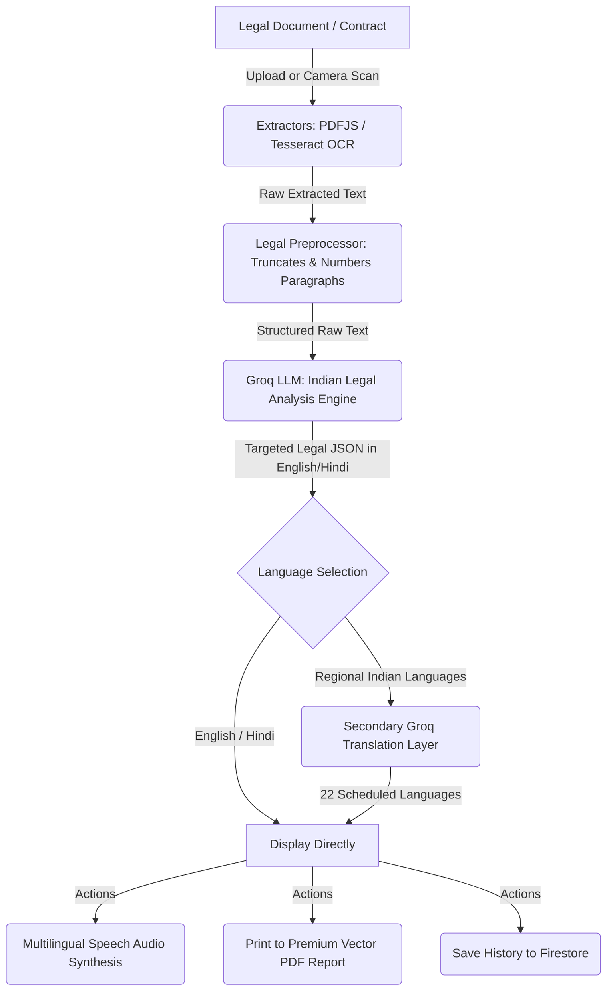

# ⚖️ न्याय सहायक | Nyay Sahayak — AI Legal Aid for India

> **Empowering Rural India with Accessible, Multilingual, and Instant Legal Document Analysis.**  
> *ग्रामीण भारत के लिए सरल भाषा में तत्काल कानूनी दस्तावेज़ विश्लेषण और कानूनी सहायता।*

---

## 📖 Introduction / परिचय

In India, complex legal jargon, high lawyer fees, and low literacy rates create huge barriers for everyday people. Small land tenants, laborers, and farmers often sign documents—such as rent agreements, employment terms, or loan covenants—without fully understanding the clauses, leaving them vulnerable to exploitation.

**Nyay Sahayak (न्याय सहायक)** is an AI-powered legal assistant designed specifically to bridge this gap. By combining high-speed AI analysis, optical character recognition (OCR), multi-dialect text-to-speech, and precise legal citations, Nyay Sahayak translates complex legal text into simple, actionable insights in **22 scheduled Indian languages**.

---

## ✨ Key Features / मुख्य विशेषताएं

*   **📄 Seamless Multi-Format Uploads**: Easily drag-and-drop or select PDF documents, contract scans, or receipts.
*   **📸 Mobile Camera OCR**: Capture agreements directly from paper with dynamic mobile camera streaming. Powered by high-fidelity Tesseract OCR.
*   **🧠 Deep AI Legal Analysis**: Analyzes documents with a strict, senior-lawyer Indian legal engine. Powered by Groq's **Llama-3.3-70b-versatile** model with tailored JSON structuring.
*   **⚠️ Severe Concern Flagging**: Identifies hidden clauses and categorizes concerns as `DANGEROUS`, `SUSPICIOUS`, or `UNFAIR`, with immediate recommendations.
*   **🏛️ Precise Indian Law Citations**: Pins applicable legal protections under exact Indian Acts and Sections (e.g., Indian Contract Act, Rent Control Act).
*   **🗣️ Speech-to-Text Auditory Support**: Listen to summaries and legal cards aloud in regional accents. Built for auditory guidance in rural villages.
*   **💾 Secure Analysis History**: Cloud Firestore integration with zero-credential fallback (transparent localStorage caching) for persistence.
*   **🖨️ Premium Vector Print Reports**: Dynamic print CSS engine enabling perfect PDF conversion with native formatting for Devanagari, Sanskrit, Telugu, and other Indian scripts.

---

## 🛠️ Technology Stack / तकनीकी संरचना

| Layer | Technologies Used |
| :--- | :--- |
| **Frontend UI** | React 18, Vite 8, Tailwind CSS v4, Lucide Icons |
| **AI Inference** | Groq API (Llama-3.3-70b-versatile) |
| **OCR Engine** | Tesseract.js (ESM worker architecture) |
| **PDF Parser** | PDF.js (Pre-optimized local Vite worker) |
| **Persistence** | Google Firebase Firestore + LocalStorage cache |
| **Speech Audio** | Web Speech Synthesis API (locale-aware BCP-47 tags) |

---

## 📐 How it Works / कार्यप्रणाली



---

## 🚀 Setup & Installation / स्थापना निर्देश

### 1. Prerequisites
Make sure you have [Node.js](https://nodejs.org/) installed (v18 or higher is recommended).

### 2. Clone and Install
```bash
# Clone the repository
git clone https://github.com/YOUR_USERNAME/Nyay-Sahayak.git

# Navigate into the project folder
cd AI_Legal_Aid

# Install package dependencies
npm install
```

### 3. Setup Environment Variables
Create a `.env` file in the root directory (based on `.env.example`):
```env
# Groq Cloud API Credentials (Required for AI Analysis)
VITE_GROQ_API_KEY=your_groq_api_key_here

# Firebase Configuration (Optional - falls back to LocalStorage if not defined)
VITE_FIREBASE_API_KEY=your_firebase_api_key
VITE_FIREBASE_AUTH_DOMAIN=your_project.firebaseapp.com
VITE_FIREBASE_PROJECT_ID=your_project_id
VITE_FIREBASE_STORAGE_BUCKET=your_project.appspot.com
VITE_FIREBASE_MESSAGING_SENDER_ID=your_sender_id
VITE_FIREBASE_APP_ID=your_app_id
```

### 4. Run Development Server
```bash
npm run dev
```
Open **`http://localhost:5173/`** (or the port displayed in your terminal) in your browser to experience Nyay Sahayak.

### 5. Build for Production
```bash
npm run build
```

---

## 🛡️ Security & Privacy / सुरक्षा और गोपनीयता

*   **Secure Keys**: Secret credentials are never stored in the source code or client bundles.
*   **Confidential Documents**: Extracted text paragraphs are processed directly via API memory and are not stored permanently unless explicitly synced by the user to their Firestore history database.
*   **Safe Pushes**: Git config is reinforced to block pushing the `.env` configuration file to GitHub.

---

## ⚖️ Disclaimer / अस्वीकरण

**यह कानूनी सलाह नहीं है। न्याय सहायक एआई-आधारित दस्तावेज़ व्याख्यान और मार्गदर्शन प्रदान करता है। किसी भी दस्तावेज पर हस्ताक्षर करने से पहले हमेशा एक पंजीकृत वकील से परामर्श करें।**

*This application is an AI assistance tool. It does not replace a professional lawyer, advocate, or formal legal advice under Indian law. Please consult a qualified legal professional before making formal legal decisions.*
